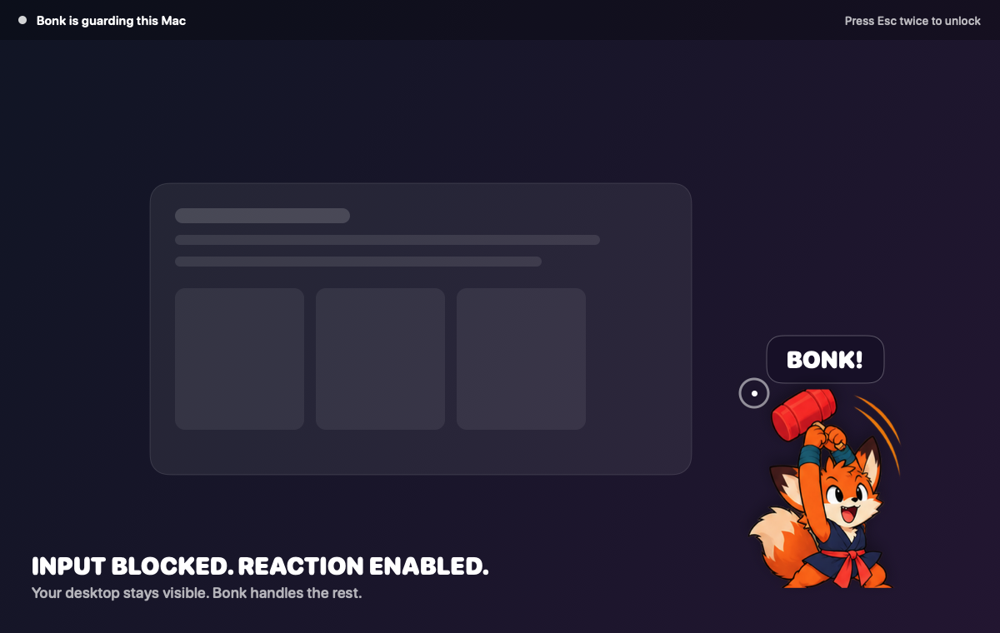
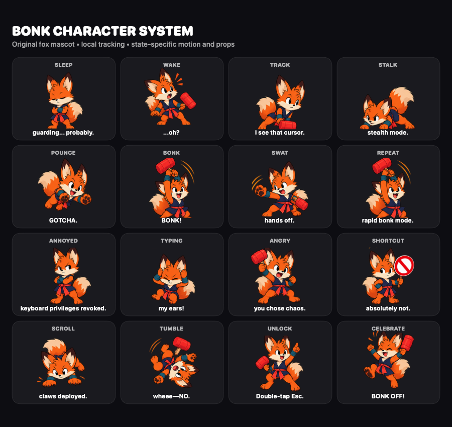

<p align="center">
  
</p>

<h1 align="center">Bonk</h1>

<p align="center"><strong>A playful input guard for macOS.</strong></p>

Keep your desktop visible and your Mac awake while a tiny fox blocks unwanted keyboard, mouse, and trackpad input.



Bonk is useful for dashboards, demos, long-running tasks, keyboard cleaning, curious pets, and any moment when the screen should stay on but hands should stay off.

> [!IMPORTANT]
> Bonk is not a replacement for the macOS Lock Screen. Anything already visible remains visible.

## Highlights

- Native SwiftUI and AppKit menu-bar app with no game engine or web runtime
- Accessibility-backed global input suppression with fail-open cleanup
- Transparent protection across every connected display
- Smooth local cursor tracking and expressive, state-specific fox reactions
- Double Escape as the only guarded-input path to macOS owner authentication
- Optional TypeSafe AI Jev reaction selection with strict validation
- Complete deterministic offline reaction fallback
- Keychain storage for the optional Jev API key
- Reproducible character assets and screenshot tooling

## Character reactions



Mouse movement, clicks, scrolling, typing, and shortcut attempts produce different poses and motion. They never open Touch ID. To unlock, press `Esc` twice within 650 milliseconds; holding the key does not count.

## Requirements

- macOS 13 or newer
- Swift 5.10 or newer
- Xcode 15.4 or newer only for the XCTest suite and contributor verification
- Accessibility permission to suppress global input
- Touch ID or another device-owner method supported by macOS

## Build from source

1. Clone the repository:

```sh
git clone https://github.com/Captain-Sangam/bonk.git && cd bonk
```

2. Build, validate, package, and launch Bonk:

```sh
make run
```

The built app is written to `dist/Bonk.app` and ad-hoc signed. `make run` works with the standalone Command Line Tools; contributors can use `make verify` with full Xcode to include the XCTest suite. On first launch, grant Bonk access under **System Settings → Privacy & Security → Accessibility**. If macOS retains permission for an earlier build, disable and re-enable the entry.

Activate Bonk from the menu-bar paw with **Bonk this Mac** or the configured `⇧⌘B` shortcut.

## Optional Jev reactions

AI reactions are off by default. Add a TypeSafe API key in Bonk Settings or set `TYPESAFE_API_KEY` for a development launch. Settings confirms the saved credential with a masked suffix; the complete value remains in the macOS Keychain.

Jev receives only coarse, aggregated interaction metadata. It never receives typed content, raw key codes, exact pointer coordinates, screen contents, application context, clipboard data, filenames, or URLs. Jev can choose presentation only—it cannot control input interception, authentication, or cleanup.

## Documentation

- [Architecture](docs/architecture.md)
- [Interaction design](docs/interaction-design.md)
- [Reaction engine](docs/reaction-engine.md)
- [Privacy and security](docs/privacy-and-security.md)
- [Character design prompts](docs/design/character-prompts.md)

## Contributing

Contributions are welcome. Read [`CONTRIBUTING.md`](CONTRIBUTING.md) for setup, validation, safety invariants, and asset guidelines. Please report vulnerabilities using [`SECURITY.md`](SECURITY.md).

Bonk is early-stage software. Review the code and understand the Accessibility permission before relying on it.

## License

Bonk is available under the [MIT License](LICENSE).
