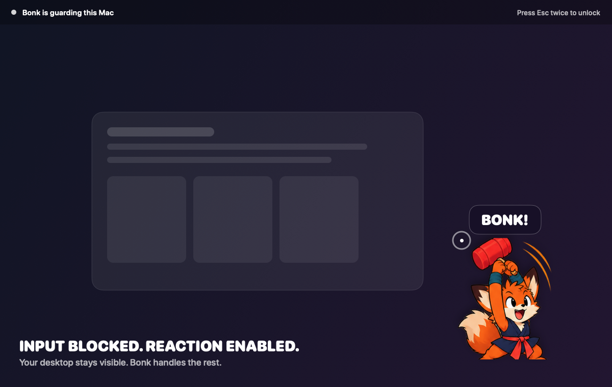
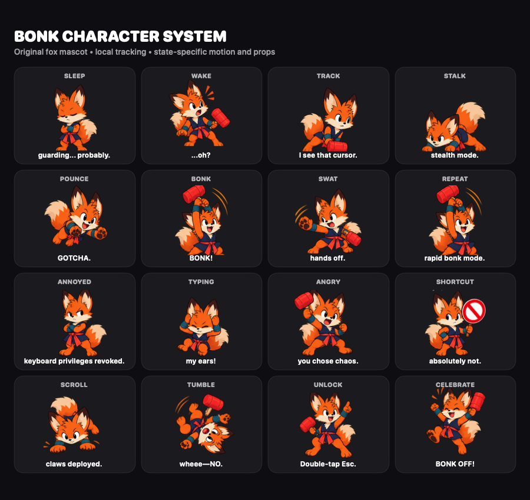

<p align="center">
  
</p>

<h1 align="center">Bonk</h1>

<p align="center"><strong>A playful macOS input guard with an on-device fox personality.</strong></p>

Keep your desktop visible and your Mac awake while a tiny fox blocks unwanted keyboard, mouse, and trackpad input. The fox chooses reactions locally from movement gestures, typing pace, and recent interactions. Jev adds optional creative direction.



Bonk is useful for dashboards, demos, long-running tasks, keyboard cleaning, curious pets, and any moment when the screen should stay on but hands should stay off.

> [!IMPORTANT]
> Bonk is not a replacement for the macOS Lock Screen. Anything already visible remains visible.

## Highlights

- Native SwiftUI and AppKit menu-bar app with no game engine or web runtime
- Accessibility-backed global input suppression with fail-open cleanup
- Transparent protection across every connected display
- Instant 120 Hz local virtual-cursor tracking, independent of network decisions
- Typing-speed energy that grows the fox up to a safe visual limit, then counts down smoothly
- On-device responses shaped by movement gestures and typing pace
- Four-second reading windows and a resting fox after 20 seconds of inactivity
- Optional Jev direction for reaction, tone, pacing, flourish, intensity, and dialogue selection
- More than 600 curated dialogue options with context filtering and anti-repetition
- Double Escape as the only guarded-input path to macOS owner authentication
- Two-second Jev quiet-period scheduling to avoid jitter during input bursts
- Strict schema, allowlist, confidence, freshness, and bounds validation around every Jev result
- Complete deterministic offline reaction engine
- Keychain storage for the optional Jev API key
- Reproducible character assets and screenshot tooling

## Character reactions



Mouse movement, clicks, scrolling, typing, and shortcut attempts produce different poses and motion. The virtual cursor follows movement immediately. While a message is within its four-second reading window, the fox stays in place so the bubble remains readable. Clicks and keys change its pose immediately while text waits; movement and scrolling respect the current reaction window. After 20 seconds without input, the fox rests and hides its bubble; the next input wakes it. Faster typing charges the fox from `1.0×` up to `1.65×`; after typing stops, it eases back to normal over four seconds.

Input attempts never open Touch ID. To unlock, press `Esc` twice within 650 milliseconds; holding the key does not count.

## Requirements

- macOS 13 or newer
- Swift 5.10 or newer
- Xcode 15.4 or newer only for the XCTest suite and contributor verification
- Accessibility permission to suppress global input
- Touch ID or another device-owner method supported by macOS

## Build from source

1. Clone the repository:

```sh
git clone https://github.com/Captain-Sangam/bonk.git && cd bonk
```

2. Build, validate, package, and install Bonk:

```sh
make export
```

Launch **Bonk** from Spotlight or Applications. The app is installed into `/Applications`, or `~/Applications` if needed. The built app also remains in `dist/Bonk.app` and is ad-hoc signed.

Use `make run` to build and launch directly from `dist/` without installing, or `make app` to package without launching. These commands work with the standalone Command Line Tools; contributors can use `make verify` with full Xcode to include the XCTest suite. Run `make` or `make help` to see all available commands.

On first launch, grant Bonk access under **System Settings → Privacy & Security → Accessibility**. If macOS retains permission for an earlier build, disable and re-enable the entry.

Activate Bonk from the menu-bar paw with **Bonk this Mac** or the configured `⇧⌘B` shortcut.

## Jev reaction engine

Jev is an optional personality and choreography add-on to Bonk's local reaction engine. With Jev enabled, after input has been quiet for two seconds, Jev directs the next beat across six dimensions in one structured decision: reaction, tone, intensity, pacing, flourish, and dialogue.

Jev results obey the same reading window as local dialogue and are discarded when stale or while the fox is resting. The dialogue library contains 636 curated lines. Bonk narrows those to at most 32 context-relevant candidates before asking Jev to choose, validates that the answer matches the selected reaction, and avoids recently used lines. A Jev Director panel in Settings shows whether the engine is waiting, deciding, applied, or using its local fallback.

Network-powered direction is opt-in because it requires a TypeSafe API key. Enable it and add a key in Bonk Settings, or set `TYPESAFE_API_KEY` for a development launch. Settings confirms the saved credential with a masked suffix; the complete value remains in the macOS Keychain.

Jev receives only coarse, aggregated interaction metadata. It never receives typed content, raw key codes, exact pointer coordinates, screen contents, application context, clipboard data, filenames, or URLs. Jev directs presentation only—it cannot control input interception, authentication, or cleanup. Without a key or network connection, the complete deterministic local reaction engine remains active.

## Documentation

- [Architecture](docs/architecture.md)
- [Interaction design](docs/interaction-design.md)
- [Reaction engine](docs/reaction-engine.md)
- [Privacy and security](docs/privacy-and-security.md)
- [Character design prompts](docs/design/character-prompts.md)

## Contributing

Contributions are welcome. Read [`CONTRIBUTING.md`](CONTRIBUTING.md) for setup, validation, safety invariants, and asset guidelines. Please report vulnerabilities using [`SECURITY.md`](SECURITY.md).

Bonk is early-stage software. Review the code and understand the Accessibility permission before relying on it.

## License

Bonk is available under the [MIT License](LICENSE).
