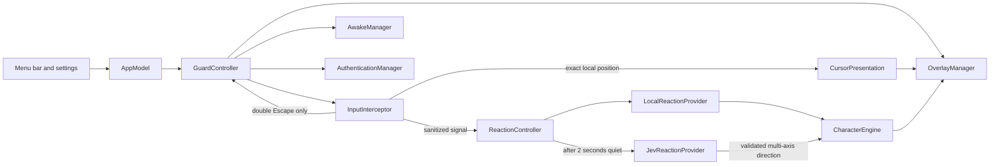
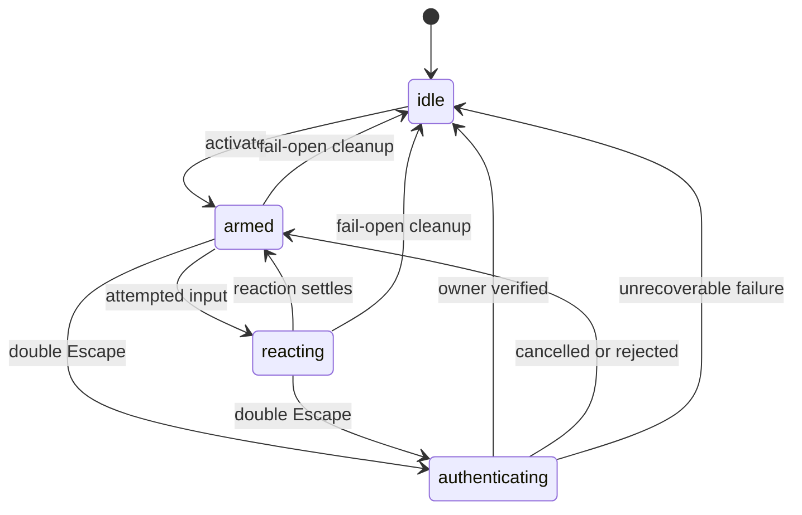

# Architecture

Bonk is a native SwiftUI and AppKit menu-bar application. Jev is the core creative director for the character engine, while the safety-critical path remains local and deterministic: input interception, owner authentication, cleanup, instant cursor presentation, and fallback reactions do not depend on network access.

## Component map

| Component | Responsibility |
| --- | --- |
| `AppModel` | Composes services, starts the global shortcut, and exposes app state to SwiftUI. |
| `GuardController` | Owns the guarded-session lifecycle and guarantees cleanup. |
| `InputInterceptor` | Suppresses Quartz input, classifies attempts, tracks the virtual cursor, and recognizes double Escape locally. |
| `ReactionController` | Presents immediate local feedback, debounces activity for two seconds, and applies only the latest validated Jev direction. |
| `JevReactionProvider` | Asks Jev to direct reaction, tone, intensity, pacing, flourish, and dialogue in one typed request. |
| `JevDirectorMonitor` | Exposes waiting, directing, applied, and local-fallback status to Settings. |
| `CharacterEngine` | Converts directed plans, dialogue history, typing energy, and local motion into a renderable presentation. |
| `DialogueCatalog` | Provides 636 bounded lines and context-filtered Jev candidate lists. |
| `OverlayManager` | Maintains one transparent, high-level window per display. |
| `AuthenticationManager` | Delegates owner verification to macOS `LocalAuthentication`. |
| `AwakeManager` | Holds the activity assertion used while Guard Mode is active. |

## Guard state machine

Activation creates every overlay before input interception begins. Shutdown and fail-open paths stop the event tap, release the power assertion, close overlays, and cancel pending reaction work.

## Input and rendering flow

The Quartz event-tap callback performs bounded local work and returns `nil` so events do not reach ordinary applications. Mouse deltas update a local virtual cursor at up to 120 Hz because the system cursor itself cannot move while events are suppressed.

Exact cursor position is published through a dedicated `CursorPresentation` and rendered without easing. The fox's body remains on its own spring-animated presentation path. `CharacterEngine` also owns the bounded typing-scale envelope and recent dialogue history.

The reaction snapshot receives only coarse direction, motion energy, typing pace, cursor region, event category, and aggregate counts. Each input resets a two-second Jev quiet-period task. A fresh result may affect character presentation but never the event tap, authentication, overlay lifecycle, or fail-open cleanup.

## Packaging

Swift Package Manager builds the core library, menu-bar executable, checks, tests, and screenshot renderer. [`Scripts/build-app.sh`](../Scripts/build-app.sh) assembles an ad-hoc signed macOS application in `dist/Bonk.app` and embeds the BonkCore resource bundle under `Contents/Resources`.
