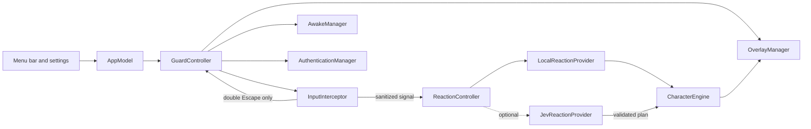
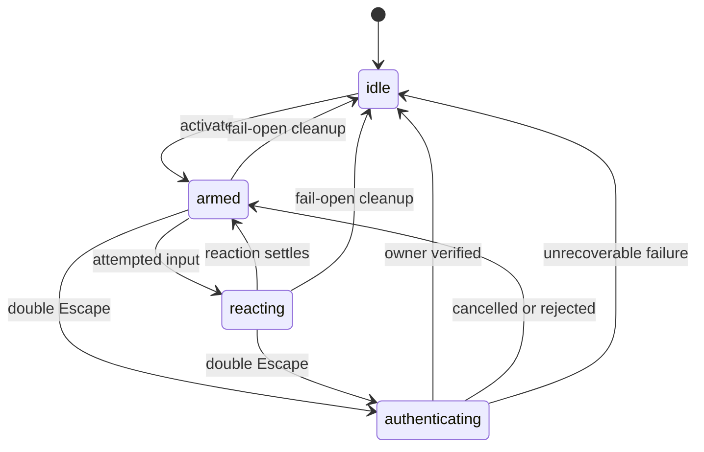

# Architecture

Bonk is a native SwiftUI and AppKit menu-bar application. Its safety-critical path is local and deterministic: input interception, owner authentication, cleanup, and offline reactions do not depend on Jev or network access.

## Component map

| Component | Responsibility |
| --- | --- |
| `AppModel` | Composes services, starts the global shortcut, and exposes app state to SwiftUI. |
| `GuardController` | Owns the guarded-session lifecycle and guarantees cleanup. |
| `InputInterceptor` | Suppresses Quartz input, classifies attempts, tracks the virtual cursor, and recognizes double Escape locally. |
| `ReactionController` | Presents an immediate local reaction and optionally requests a validated Jev replacement. |
| `CharacterEngine` | Converts reaction plans and local cursor state into a renderable presentation. |
| `OverlayManager` | Maintains one transparent, high-level window per display. |
| `AuthenticationManager` | Delegates owner verification to macOS `LocalAuthentication`. |
| `AwakeManager` | Holds the activity assertion used while Guard Mode is active. |

## Guard state machine

Activation creates every overlay before input interception begins. Shutdown and fail-open paths stop the event tap, release the power assertion, close overlays, and cancel pending reaction work.

## Input and rendering flow

The Quartz event-tap callback performs bounded local work and returns `nil` so events do not reach ordinary applications. Mouse deltas update a local virtual cursor at up to 60 Hz because the system cursor itself cannot move while events are suppressed.

`CharacterEngine` owns exact cursor positions and animation state. The reaction snapshot receives only coarse direction, motion energy, cursor region, event category, and aggregate counts.

## Packaging

Swift Package Manager builds the core library, menu-bar executable, checks, tests, and screenshot renderer. [`Scripts/build-app.sh`](../Scripts/build-app.sh) assembles an ad-hoc signed macOS application in `dist/Bonk.app` and embeds the BonkCore resource bundle under `Contents/Resources`.
