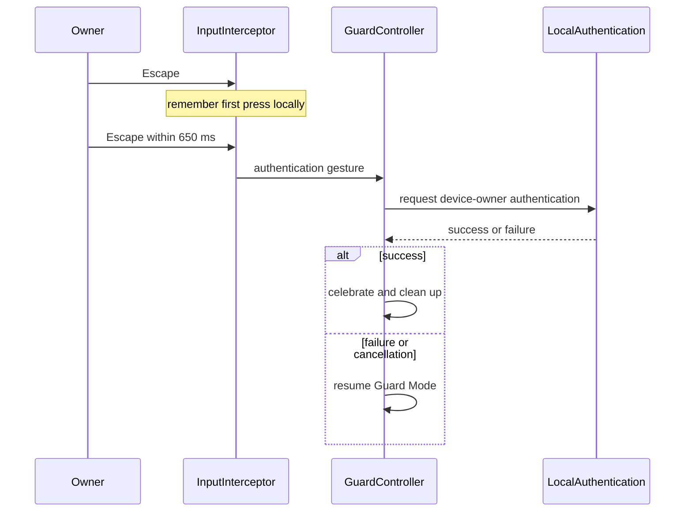

# Interaction design

Bonk protects a still-visible desktop without behaving like a conventional lock screen. The character is the primary interface: input attempts produce short, readable reactions while the underlying applications receive nothing.

## Activate

Choose **Bonk this Mac** from the menu-bar paw or use the configured `⇧⌘B` shortcut. Activation has no confirmation dialog. Bonk creates transparent overlays on every display, starts the keep-awake assertion, and then enables input interception.

## Guarded behavior

| Attempt | Character behavior | System behavior |
| --- | --- | --- |
| Gentle pointer movement | Wake, look, and follow | Movement is suppressed; the virtual cursor updates instantly while the fox trails expressively. |
| Fast movement | Stalk or pounce | Speed and dominant direction remain local/coarse. |
| Clicks | Bonk, swat, or repeat-bonk | Clicks never reach the underlying app. |
| Typing | Grow with typing pace; annoyed, cover ears, or angry | Non-repeat key rate drives a bounded local scale envelope; typed content is never retained or sent. |
| Shortcut | Raise a stop sign | The shortcut is suppressed like other guarded input. |
| Scroll | Cling or tumble | Scroll magnitude and direction drive the pose. |
| Persistent activity | Show the unlock hint | Activity alone never opens authentication. |

The virtual cursor and fox deliberately use different motion systems. The cursor maps directly to the latest local virtual position at up to 120 Hz and has no easing. The fox keeps spring movement, poses, and secondary animation so it feels alive without making the pointer target lag.

Typing charges the fox from `1.0×` to a maximum of `1.65×`. After 350 milliseconds of quiet, the character shrinks smoothly back to normal over four seconds. A new burst interrupts the countdown and builds from the current size. Holding one key does not add energy.

## Jev-directed next beats

Immediate reactions are local. Once input has been quiet for two seconds, Jev directs the next character beat by choosing a reaction, personality tone, intensity, story pacing, visual flourish, and one context-relevant line from the curated catalogue. This turns a burst into a small progression—such as sleepy, alert, smug, then cooldown—instead of allowing network responses to fight active movement.

The Jev Director section in Settings makes the state concrete: waiting for input to settle, directing, applied, or local fallback. It also shows the latest bounded decision and the number of Jev calls in the guarded session.

## Unlock

The only guarded-input gesture that starts macOS authentication is two separate Escape key presses within 650 milliseconds.

Holding Escape does not count because auto-repeat events are ignored. An intervening non-Escape key resets the sequence. Mouse movement, clicks, scrolling, ordinary typing, shortcuts, and reaction escalation cannot open the authentication prompt.

During authentication, the event tap pauses and the overlay captures the desktop so macOS can accept Touch ID or its system-controlled fallback. Bonk never implements or stores an owner password.

## Settings feedback

The Jev credential card shows one of two concrete states: **No key saved** or **Key saved securely**, including only the final four characters. Saving clears the field and shows a success acknowledgement. The full value stays in the macOS Keychain and is never displayed again.
