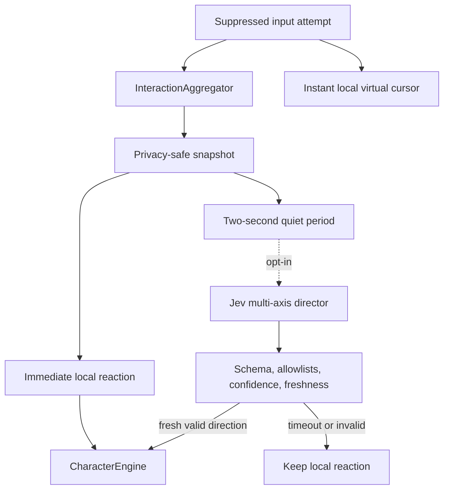

# Reaction engine

Jev is the core creative decision layer in Bonk's character engine. It directs what the fox does next, which personality tone it uses, how the mini-story should progress, which flourish appears, the reaction intensity, and the dialogue line. The safety-critical guard loop and immediate feedback remain deterministic and local, so network latency or failure can never delay input suppression or leave the app without a reaction.

## Decision flow

Every relevant input resets the quiet-period timer. Jev is called only after the activity has been still for two seconds, so an active mouse or typing burst cannot continually replace the fox's state. Only one request may be in flight; newer activity cancels it, and only the newest result in the active guarded session can be applied. Requests use a short timeout and are cancelled when Guard Mode ends.

The virtual cursor uses a separate, non-animated presentation path updated at up to 120 Hz. It never waits for Jev and does not inherit the fox's spring animation. The fox itself continues to trail, look, pounce, and react expressively.

## Snapshot contract

The encoded snapshot may contain:

- interaction category;
- recent category counts and a rate bucket;
- guarded-session duration bucket;
- escalation level and current character state;
- the last three bounded character beat labels (reaction, tone, and pacing);
- coarse cursor region and a session-local display index;
- coarse motion-energy and dominant-direction buckets.
- a coarse typing-pace bucket: none, slow, steady, fast, or frantic.

It never contains typed characters, raw key codes, exact coordinates, cursor paths, screenshots, clipboard data, app names, window titles, filenames, document contents, or URLs.

## Jev direction contract

One request asks Jev several independent typed questions in parallel:

| Axis | Bounded output |
| --- | --- |
| Reaction | A value from `ReactionIntent`, such as follow, pounce, bonk, cover ears, or tumble |
| Tone | Playful, smug, grumpy, encouraging, dramatic, or sleepy |
| Intensity | A normalized score from quiet to maximum drama |
| Pacing | Escalate, sustain, or cool down |
| Flourish | None, hop, shake, spin, pose, or sparkle |
| Dialogue | One ID from a context-filtered curated shortlist |

The complete catalogue contains 636 curated dialogue options. Before a request, Bonk selects at most 32 candidates spanning plausible reactions and adds extra choices for the immediate local intent. Jev chooses an ID, never generates arbitrary display text. Bonk verifies that the chosen line was offered, belongs to the selected reaction, and has not appeared in the recent history.

Reaction state requires at least `0.60` confidence. Tone, pacing, flourish, dialogue, and intensity are gated independently at `0.50`, so one uncertain styling answer does not invalidate an otherwise useful direction.

Unknown intents, malformed data, low-confidence answers, stale replies, network failures, and timeouts are discarded. The immediate local reaction remains visible.

## Typing energy

Non-repeat key presses are measured over a rolling 1.5-second window. Their rate charges the fox from `1.0×` to a hard maximum of `1.65×`. After 350 milliseconds without a new key press, a smooth four-second envelope returns the character to normal size. Holding a key cannot inflate the fox because macOS autorepeat events are excluded.

## Safety boundary

Jev cannot:

- allow or forward input;
- detect the double-Escape gesture;
- start or approve authentication;
- keep Guard Mode active;
- bypass permissions;
- generate arbitrary dialogue, code, or assets;
- prevent cleanup.
