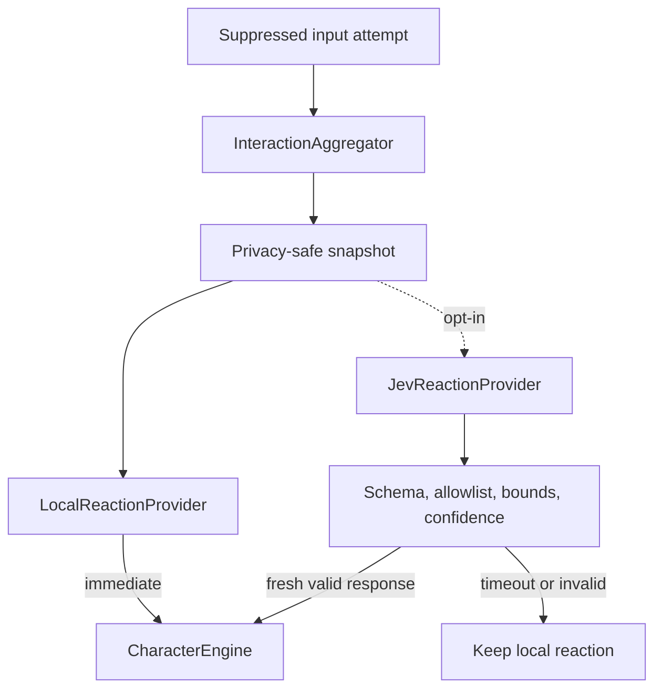

# Reaction engine

Bonk always has a complete deterministic reaction system on device. Jev is an optional personality layer that may select from curated reactions; it is never part of input suppression, authentication, or cleanup.

## Decision flow

High-frequency activity is coalesced before network work begins. Only the newest request in the active guarded session may replace the local presentation. Requests use a short timeout and are cancelled when Guard Mode ends.

## Snapshot contract

The encoded snapshot may contain:

- interaction category;
- recent category counts and a rate bucket;
- guarded-session duration bucket;
- escalation level and current character state;
- coarse cursor region and a session-local display index;
- coarse motion-energy and dominant-direction buckets.

It never contains typed characters, raw key codes, exact coordinates, cursor paths, screenshots, clipboard data, app names, window titles, filenames, document contents, or URLs.

## Curated intents

Jev can select only values represented by `ReactionIntent`, including notice, follow, stalk, pounce, bonk, swat, repeat bonk, annoyance, cover ears, angry, block shortcut, cling, tumble, and the double-Escape hint. It can also score intensity within a bounded range.

Unknown intents, malformed data, low-confidence answers, stale replies, network failures, and timeouts are discarded. The immediate local reaction remains visible.

## Safety boundary

Jev cannot:

- allow or forward input;
- detect the double-Escape gesture;
- start or approve authentication;
- keep Guard Mode active;
- bypass permissions;
- choose arbitrary dialogue, code, or assets;
- prevent cleanup.
