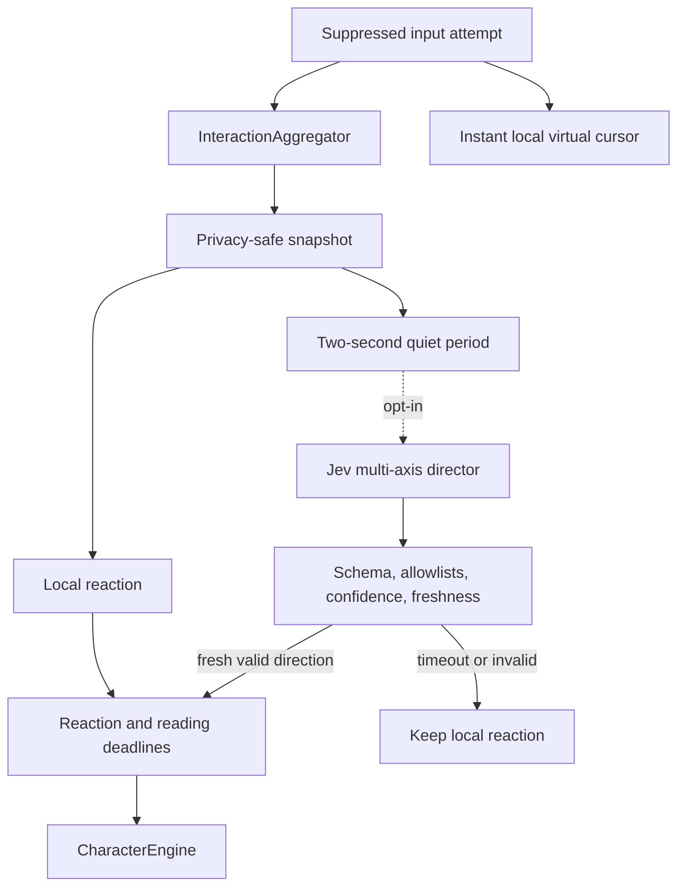

# Reaction engine

Bonk chooses its core reactions on-device using movement gestures, typing pace, and recent character beats. Jev is an optional director for reaction, tone, pacing, flourish, intensity, and curated dialogue. The guard loop and immediate feedback remain deterministic and local, so network latency or failure can never delay input suppression or leave the app without a reaction.

## Decision flow

```mermaid
flowchart TD
    Event[Suppressed input attempt] --> Aggregate[InteractionAggregator]
    Event --> Cursor[Instant local virtual cursor]
    Aggregate --> Snapshot[Privacy-safe snapshot]
    Snapshot --> Local[Local reaction]
    Local --> Gates[Reaction and reading deadlines]
    Gates --> Character[CharacterEngine]
    Snapshot --> Debounce[Two-second quiet period]
    Debounce -. opt-in .-> Jev[Jev multi-axis director]
    Jev --> Validate[Schema, allowlists, confidence, freshness]
    Validate -->|fresh valid direction| Gates
    Validate -->|timeout or invalid| Keep[Keep local reaction]
```

Every relevant input resets the quiet-period timer. Jev is called only after the activity has been still for two seconds, so an active mouse or typing burst cannot continually replace the fox's state. Only one request may be in flight; newer activity cancels it, and only the newest result in the active guarded session can be applied. Requests use a short timeout and are cancelled when Guard Mode ends.

The virtual cursor uses a separate, non-animated presentation path updated at up to 120 Hz. It never waits for Jev and does not inherit the fox's spring animation. Gaze and facing remain live while the fox's position and display stay fixed during a message's reading window.

## Readability and rest

Messages have a four-second minimum display window. Clicks, key presses, rapid clicks, and shortcut attempts restart the fox's pose immediately, while their dialogue waits for the current message's window to finish. Only the newest pending message is published, without replaying the animation. Movement and scrolling wait until both the last pose and the last message have had four seconds; changing intent cannot bypass these deadlines. Jev obeys the same message window, and newer input invalidates a queued Jev result. If that result had replaced pending local dialogue, the local dialogue is restored; disabling Jev before publication has the same effect.

After 20 seconds without input, the fox sleeps and hides its bubble. Rest waits for any visible or due pending message to receive its full reading time. The next input wakes the fox immediately with cleared recent activity. Pending dialogue and Jev work are cancelled on rest or session end. Authentication cancels previous work while retaining a rest timer, so cancelling the macOS authentication sheet does not leave the fox awake indefinitely. Authentication guidance also respects the existing text's reading window.

These intervals are injectable for tests; they have no settings UI.

## Local context

Movement samples belong to one gesture until a 0.75-second gap. A continuous gesture keeps its duration even after the five-second activity window rolls forward. Movement contributes at most two gestures to escalation and interaction rate, so cursor drift alone cannot trigger the double-Escape prompt. Frantic flicks pounce, brief first gestures notice, and sustained movement (two seconds) or repeated gestures stalk. Intermediate movement follows the cursor.

Slow typing annoys the fox, steady typing covers its ears, and fast or frantic typing makes it angry. Tone varies when the previous presented beat had the same intent and tone. Dialogue history records only lines that actually become visible.

## Snapshot contract

The encoded snapshot may contain:

- interaction category;
- recent category counts (movement is counted as gestures) and a rate bucket;
- guarded-session duration bucket;
- escalation level and current character state;
- the last three bounded character beat labels (reaction, tone, and pacing);
- coarse cursor region and a session-local display index;
- coarse motion-energy and dominant-direction buckets.
- a coarse typing-pace bucket: none, slow, steady, fast, or frantic.

It never contains typed characters, raw key codes, exact coordinates, cursor paths, screenshots, clipboard data, app names, window titles, filenames, document contents, or URLs.

Gesture duration is local selection context and is excluded from snapshot encoding; the Jev wire format is unchanged.

## Jev direction contract

One request asks Jev several independent typed questions in parallel:

| Axis | Bounded output |
| --- | --- |
| Reaction | A value from `ReactionIntent`, such as follow, pounce, bonk, cover ears, or tumble |
| Tone | Playful, smug, grumpy, encouraging, dramatic, or sleepy |
| Intensity | A normalized score from quiet to maximum drama |
| Pacing | Escalate, sustain, or cool down |
| Flourish | None, hop, shake, spin, pose, or sparkle |
| Dialogue | One ID from a context-filtered curated shortlist |

The complete catalogue contains 636 curated dialogue options. Before a request, Bonk selects at most 32 candidates spanning plausible reactions and adds extra choices for the immediate local intent. Jev chooses an ID, never generates arbitrary display text. Bonk verifies that the chosen line was offered, belongs to the selected reaction, and has not appeared in the recent history.

Reaction state requires at least `0.60` confidence. Tone, pacing, flourish, dialogue, and intensity are gated independently at `0.50`, so one uncertain styling answer does not invalidate an otherwise useful direction.

Unknown intents, malformed data, low-confidence answers, stale replies, network failures, and timeouts are discarded. The immediate local reaction remains visible.

## Typing energy

Non-repeat key presses are measured over a rolling 1.5-second window. Their rate charges the fox from `1.0×` to a hard maximum of `1.65×`. After 350 milliseconds without a new key press, a smooth four-second envelope returns the character to normal size. Holding a key cannot inflate the fox because macOS autorepeat events are excluded.

## Safety boundary

Jev cannot:

- allow or forward input;
- detect the double-Escape gesture;
- start or approve authentication;
- keep Guard Mode active;
- bypass permissions;
- generate arbitrary dialogue, code, or assets;
- prevent cleanup.
